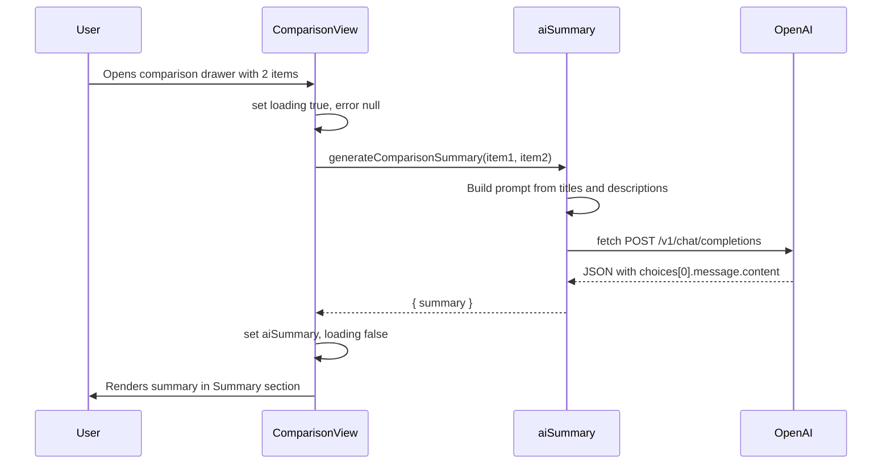

# Implement AI comparison summary with OpenAI + fetch + env

## Approach

- **No backend**: The Expo app calls `https://api.openai.com/v1/chat/completions` directly with `fetch()`.
- **API key**: Read from `process.env.EXPO_PUBLIC_OPENAI_API_KEY` (set via `.env`).
- **Single process**: You still run only `npm start`; no separate API server.

**Security note**: `EXPO_PUBLIC_*` values are embedded in the client bundle, so the key can be extracted from the app. This is acceptable for development or low-risk use; for production at scale, a backend proxy is safer.

---

## 1. Environment and API key

- **Create `.env**` in the project root (same level as `package.json`):
  ```bash
  EXPO_PUBLIC_OPENAI_API_KEY=sk-your-openai-key-here
  ```
- **Ignore it in Git**: Add `.env` to [.gitignore](.gitignore) so the key is never committed (only `.env*.local` is ignored today).
- **Usage in code**: Use **static** access so Expo can inline the value at build time:
  ```js
  const apiKey = process.env.EXPO_PUBLIC_OPENAI_API_KEY;
  ```
- **Optional**: Add a `.env.example` with `EXPO_PUBLIC_OPENAI_API_KEY=` (no value) and document in README.

---

## 2. New service: `src/services/aiSummary.js`

Single exported function used by the comparison screen.

**Function**: `generateComparisonSummary(item1, item2)`

- **Input**: Two innovation objects with at least `title`, `shortDescription`, `longDescription`.
- **Build description text** per item: `[shortDescription, longDescription].filter(Boolean).join('\n\n')`. Optionally cap each at ~1500–2000 characters to stay within token limits and cost.
- **Build prompt**: System + user message asking the model to write a short comparative summary (2–4 sentences or a few bullets): what each does, main similarities, differences, when to choose which. Request plain text only.
- **Request**:
  - `POST https://api.openai.com/v1/chat/completions`
  - Headers: `Authorization: Bearer <apiKey>`, `Content-Type: application/json`
  - Body: `{ model: 'gpt-4o-mini', messages: [...], max_tokens: 400 }` (or `gpt-4o` if you prefer; mini keeps cost low)
- **Response**: Read `response.json()`, then `data.choices[0].message.content`. If no key or request fails, throw a clear error (e.g. "Missing API key" or "Summary request failed").
- **Timeout**: Use `AbortController` with ~20s so the UI doesn’t hang.
- **Return**: Resolve with `{ summary: string }` or reject on error.

**Edge case**: If both items have no description text, return early with something like `{ summary: 'No descriptions available to compare.' }` and do not call the API.

---

## 3. Changes in [src/screens/BookmarksScreen.js](src/screens/BookmarksScreen.js)

**ComparisonView** (the component that receives `item1` and `item2`):

- **State**: Add `aiSummary` (string or null), `aiSummaryLoading` (boolean), `aiSummaryError` (string or null).
- **Effect**: When `item1` and `item2` are both set, set loading true and error null, then call `generateComparisonSummary(item1, item2)`. On success set `aiSummary` to the returned summary and clear loading/error; on failure set `aiSummaryError` and clear loading. Reset `aiSummary` when `item1` or `item2` changes (new comparison).
- **Summary section UI** (replace or augment the current "Description" row around lines 246–251):
  - **Loading**: Show a short "Generating summary…" line and an `ActivityIndicator` inside the Summary section.
  - **Success**: Show the AI summary text in a block (reuse existing `compareSectionBody`-style container; allow text to wrap/scroll if needed).
  - **Error**: Show a short message (e.g. "Could not generate summary") and a "Retry" button that re-runs the same effect (e.g. by incrementing a `retryCount` in the dependency array or calling a ref-based fetch function).
  - **No key / no descriptions**: If there’s no API key or no text to send, show a fallback message and do not call the API.
- **Keep** the existing Cost, Complexity, Grassroots rows below the AI summary block.

**Import**: Add `import { generateComparisonSummary } from '../services/aiSummary';`.

---

## 4. Flow summary




---

## 5. Files to add or touch


| Action              | File                                                                                                         |
| ------------------- | ------------------------------------------------------------------------------------------------------------ |
| Create              | `src/services/aiSummary.js` — OpenAI fetch + prompt + timeout                                                |
| Modify              | [src/screens/BookmarksScreen.js](src/screens/BookmarksScreen.js) — state, effect, Summary section UI, import |
| Modify              | [.gitignore](.gitignore) — add `.env` if not already ignored                                                 |
| Create (optional)   | `.env.example` — `EXPO_PUBLIC_OPENAI_API_KEY=`                                                               |
| Document (optional) | README — how to set the key and run the app                                                                  |


---

## 6. Running the app

- Set `EXPO_PUBLIC_OPENAI_API_KEY` in `.env`.
- Run `**npm start**` as usual; no extra process.
- Open the comparison drawer with two bookmarked innovations; the Summary section will show loading then the AI summary (or error + Retry).

