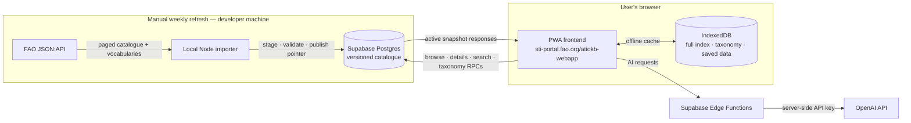

# Supabase web architecture

The web app is served from `https://sti-portal.fao.org/atiokb-webapp`. A developer runs the weekly catalogue importer manually from a local machine; the browser reads the published snapshot from Supabase.

## Trust and runtime notes

- The browser ships only the Supabase URL and publishable key. Catalogue reads go through scoped read RPCs; importer/database and OpenAI credentials remain server-side.
- IndexedDB remains the offline store for the full catalogue index, taxonomy cache and locally saved records. The service worker continues to cache the PWA shell.
- FAO is contacted by the manually run importer, not by migrated browser flows.
- The importer remains a local command initially. A future GitHub Actions workflow will run the same script; it does not change the data flow or publish transaction.
